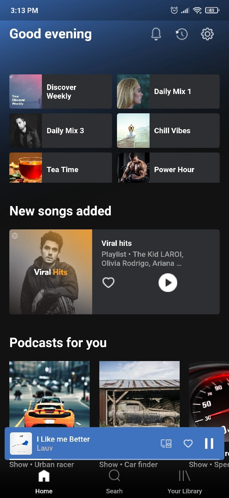
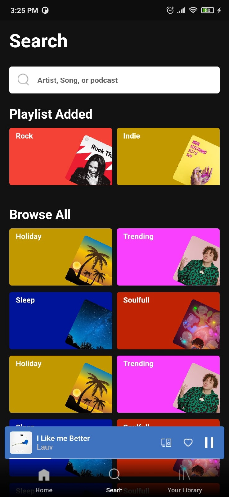
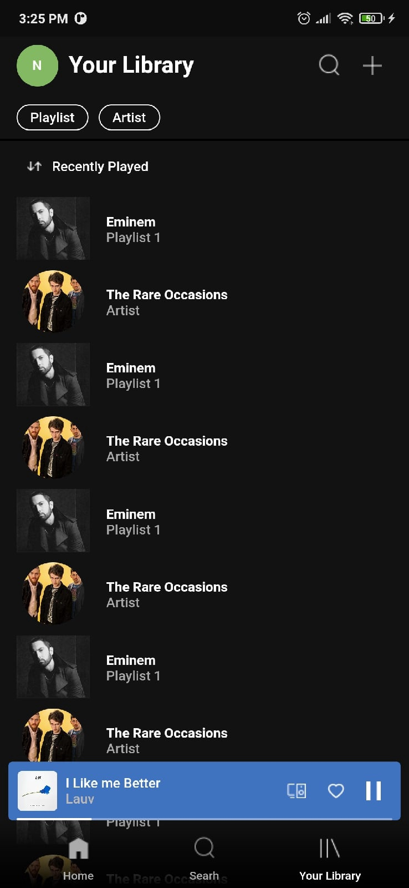
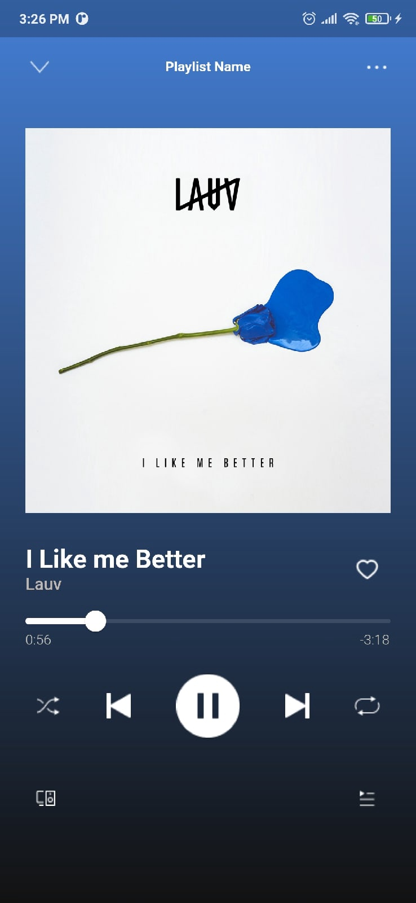

# Spotify Ui clone 

## My Goal

The objective of this project is to look at how we can customise Flutter Widgets to achieve beautiful user interface designs by example spotify.

## What you will create

  
  

## Contact
Created by [@Nurshat](https://www.upwork.com/freelancers/~01e2f995d8f7838143) aka Light - feel free to contact me!

## Getting Started
A few resources to get you started if this is your first Flutter project:

- [Lab: Write your first Flutter app](https://flutter.dev/docs/get-started/codelab)
- [Cookbook: Useful Flutter samples](https://flutter.dev/docs/cookbook)

For help getting started with Flutter, view our
[online documentation](https://flutter.dev/docs), which offers tutorials,
samples, guidance on mobile development, and a full API reference.
